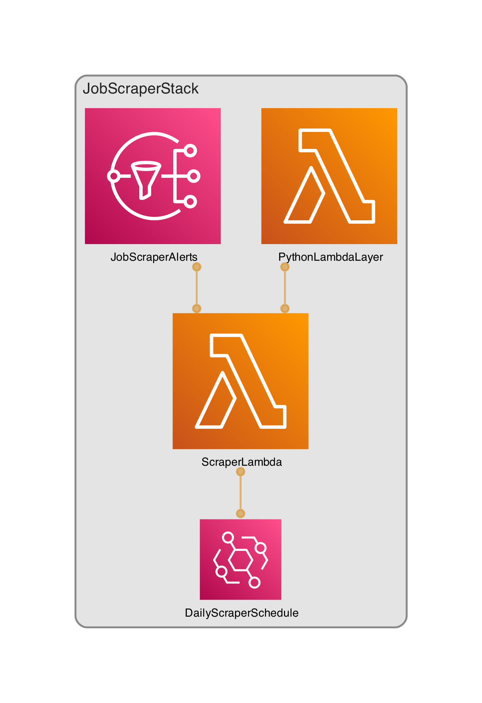

# 🚀 Welcome to Job Scraper

This is a 3 hours 🕒 project aiming to show how you can leverage the AWS Free Tier and OpenAI API to solve a simple weekend challenge: Get notified for new opening of a given company for the location in Germany, Munich via email at nearly 0 cost fully automated via IaC (Infrastructure as Code). In this sample code we scrap the following websites:

- Reuters AI News: https://www.reuters.com/technology/artificial-intelligence/
- PR Newswire: https://www.prnewswire.com/news-releases/
- LinkedIn Jobs: https://www.linkedin.com/company/openai/jobs/

*We use OpenAI as the company here as this was the challenge a friend of mine wanted to solve. You can exchange the links above with other companies.

## Architecture diagram

This is the architecture of the resources deployed in the AWS Account. The ScraperLambda communicates via REST API with OpenAI API to fetch the Daily Quote. Read more below in the section "Cost".




## Local Environment Requirements

You need to have the following dependencies in place:

- AWS Account
- Mac OS
- Bash/ZSH terminal
- Docker version 24.0.x
- aws-cli v2 [here](https://docs.aws.amazon.com/cli/latest/userguide/getting-started-install.html)
- AWS credentials and profiles for each environment under ~/.aws/config [here](https://docs.aws.amazon.com/cli/latest/userguide/cli-configure-files.html)
- Node v22.01.* && NPM v10.7.*
- Python >= 3.13

To get started you will need to have your .env created in the root of the project and it has to contain the following:

```bash
export AWS_ACCOUNT_ID= ### your AWS Account ID
export AWS_PROFILE= ### your AWS Profile, check the ## Local Environment Requirements above
export AWS_REGION= ### your AWS Region, solution was tested in eu-central-1 but should be working also in other regions as well
export LOCAL_ENV=true ### this is used to test the lambda/screper.py locally, e.g: python3 lambda/scraper.py
export MAIN_SEARCHTERM= ### this is the main search term, e.g: OpenAI, Amazon etc
export OPENAI_API_KEY= ### your openai api key used to generate quote of the day in case there is no news on the new job location opening (keeping motivation high :D)
export SNS_SUBSCRIBERS= ### comma separated list of emails, make sure to keep this in mind when accepting your subscription: https://repost.aws/knowledge-center/prevent-unsubscribe-all-sns-topic 
```

```bash
source .env ### source the exported vars above
```

## Bootstrap & Deploy

Once you have sourced your env and have all the preconditions above then proceed and deploy the code using the following command:

```bash
npx cdk bootstrap    ### if the account isnt already bootstrapped
npx cdk deploy --all ### deploys the entire solution into your AWS Account
```

## Notification

Subscribers get notified via email once a day at 09:00 UTC. This can be configured in `lib/job-scraper-stack.ts#L64`
Please note that you must subscribe following [this guide](https://repost.aws/knowledge-center/prevent-unsubscribe-all-sns-topic) and not just click the link received in your email as then the spam filters will cause automatical unsubscribtion.

## Cost

This solution aims to stay in the AWS Free Tier and the only cost is for the Daily Quote Generator which is depending on the OpenAI API. If you wish to not use that then just comment out the code in lambda/scraper.py#L193 with empty string, e.g: `quote_of_the_day=""`

The `cdk.json` file tells the CDK Toolkit how to execute your app.

## Useful links

- [AWS Free Tier](https://aws.amazon.com/free/)
- [OpenAI Platform](https://platform.openai.com/docs/overview)


## Useful commands

* `npm install`       installs all the deps from the package.json (make sure you use Node v22 and above)  
* `npm run build`     compile typescript to js
* `npm run lint`      checks the linting
* `npm run lint:fix`  lints the code in TypeScript and Python
* `npx cdk bootstrap` bootstraps the AWS Account with your default AWS account/region
* `npx cdk deploy`    deploy this stack to your default AWS account/region
* `npx cdk diff`      compare deployed stack with current state
* `npx cdk synth`     emits the synthesized CloudFormation template


## Disclaimer

This project is provided for demonstration purposes only and is not intended for commercial use. Its sole purpose is to showcase what can be achieved by combining the OpenAI API with the AWS Free Tier.